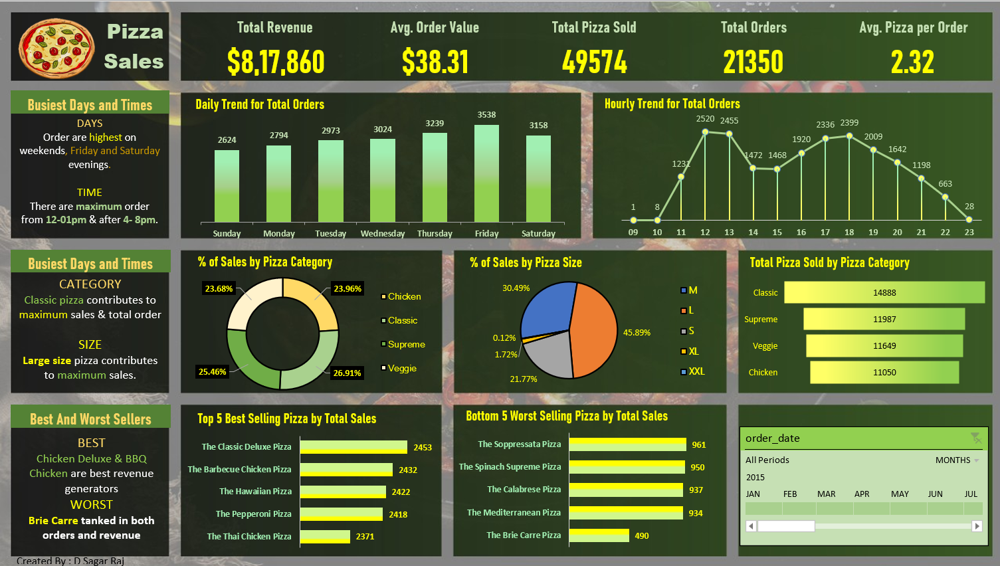

# 🍕 Pizza Sales Dashboard

An interactive **Microsoft Excel Dashboard** developed using **SQL** and **Microsoft Excel** to analyze pizza sales performance, customer ordering patterns, and business KPIs.

---

## 📌 Project Overview

The Pizza Sales Dashboard is designed to transform raw sales data into meaningful business insights. SQL was used to query and analyze the sales data, while Microsoft Excel was used to build an interactive dashboard for visualizing key performance indicators and sales trends.

The dashboard enables users to monitor business performance, identify best-selling products, analyze customer purchasing behavior, and support data-driven decision-making.

---

## 🛠 Tools & Technologies

- Microsoft SQL
- Microsoft Excel

---

## 📊 Dashboard Features

# KPI Cards

- Total Revenue
- Total Orders
- Total Pizzas Sold
- Average Order Value
- Average Pizzas per Order

# Sales Analysis

- Daily Sales Trend
- Monthly Sales Trend
- Sales by Pizza Category
- Sales by Pizza Size
- Top 5 Best-Selling Pizzas
- Bottom 5 Lowest-Selling Pizzas

# Interactive Features

- Dynamic Charts
- Interactive Dashboard

# 🗄 SQL Concepts Used

- Aggregate Functions
- GROUP BY
- ORDER BY
- CASE Statements
- CTEs
- Window Functions
- Date Functions
- Joins
- Subqueries

# 📊 Excel Features Used

- Pivot Tables
- Pivot Charts
- Slicers
- Conditional Formatting
- KPI Cards
- Data Cleaning
- Interactive Dashboard

#📷 Dashboard Preview

#📈 Key Business Insights

- Identified the highest revenue-generating pizza categories.
- Analyzed daily and monthly sales trends to understand customer demand.
- Compared pizza sales by category and size.
- Identified the top and bottom-selling pizzas based on revenue and quantity sold.
- Evaluated overall business performance using key sales KPIs.

#💡 Skills Demonstrated

- SQL Querying
- Data Cleaning
- Data Analysis
- KPI Reporting
- Dashboard Design
- Microsoft Excel
- Business Intelligence
- Data Visualization

#🎯 Business Objective

To provide an interactive sales dashboard that helps stakeholders monitor sales performance, evaluate product popularity, and identify opportunities for business growth through data-driven insights.

---

# 👨‍💻 Author
D Sagar Raj 

GitHub: https://github.com/SagarRaj-17
